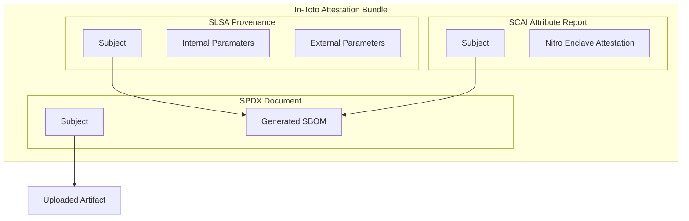

# SBOM Server #

This is a simple HTTP-based network service that generates a _Software Bill of
Material_ (SBOM) from an uploaded artifact. When run within an enclave, this
server achieves a [SLSA Security Level][levels] of either [Build L2][l2] or
[Build L3][l3], depending on the initial arguments and the configuration of the
enclave image.

A demonstration instance of this service is running within an AWS Nitro Enclave
on sbom-server.demo.edgebit.io. The machine is very small, so don't be surprised
if a "502 Bad Gateway" error is returned - this means it's tied up handling
another request - and do not rely on it being available. The following command
shows how a container image can be exported from docker and sent to the demo
server:

```sh
docker image save hello-world | \
    ./client --verbose --host sbom-server.demo.edgebit.io sbom --attest docker-archive:-
```

## Overview ##

The server is designed to run within an enclave, specifically AWS Nitro Enclaves
at the moment, but it can also operate outside, though this drops the Security
Level down to [Build L0][l0]. When it runs within an enclave, it will
cryptographically attest the authenticity of the generated SBOM and root the
proof to the AWS Nitro Attestation PKI. This is provided as an [in-toto
attestation bundle][bundle] containing the following attestations:

- [SLSA Provenance][provenance] - indicates the versions of the server and
  external tools, as well as the initial arguments to the server
- [SCAI Attribute Report][scai] - contains the enclave attestation document
  which proves the enclave image and the public key for the signatures on the
  other attestations in the bundle
- [SPDX Document][spdx] - contains the SPDX-formatted SBOM generated from the
  provided artifact

Creation of this bundle happens only when attestation is requested, and it
implies that both the server and the external SBOM-generator tool ran within an
enclave.

The generation of the SBOM is done by one of the external tools supported by
`sbom-server` (currently only `syft` is supported).

[bundle]: https://github.com/in-toto/attestation/blob/v1.0/spec/v1.0/bundle.md
[l0]: https://slsa.dev/spec/v1.0/levels#build-l0
[l2]: https://slsa.dev/spec/v1.0/levels#build-l2
[l3]: https://slsa.dev/spec/v1.0/levels#build-l3
[levels]: https://slsa.dev/spec/v1.0/levels
[provenance]: https://slsa.dev/spec/v1.0/provenance
[scai]: https://github.com/in-toto/attestation/blob/v1.0/spec/predicates/scai.md
[spdx]: https://github.com/in-toto/attestation/blob/v1.0/spec/predicates/spdx.md

## API ##

Artifacts are uploaded with an HTTP POST which specifies the format of the
archive using the `Content-Type` header.

| Endpoint        | Description                                                 |
|-----------------|-------------------------------------------------------------|
| `/spdx`         | Generates an SPDX-formatted SBOM                            |
| `/in-toto/spdx` | Generates an SBOM, wrapped in an in-toto attestation bundle |

The following are accepted in the `Content-Type` header:

| Header Value                               | Description                      |
|--------------------------------------------|----------------------------------|
| `application/x-tar; scheme=docker-archive` | A docker container image archive |
| `application/x-tar; scheme=oci-archive`    | An OCI image archive             |

### In-Toto Response ###

When the endpoint under `/in-toto` is used, the response is an in-toto
attestation bundle which contains the generated SBOM, along with the proof of
its generation:



The authenticity of this bundle can be verified as follows:

1. Verify the authenticity of the Nitro Enclave attestation
   (e.g. [Attestation Explorer][explorer])
2. Verify that the digest in PCR 0, covering the contents of the enclave image,
   is a known-good value
3. Verify the signatures of the three envelopes using the public key from the
   Nitro Enclave attestation
4. Calculate the digest of the generated SBOM and verify that it matches the
   digests of the subjects for the SCAI Attribute Report and the SLSA Provenance
5. Calculate the digest of the uploaded artifact and verify that it matches the
   digest of the subject of the SPDX Document

[explorer]: https://edgebit.io/attestation/

## Packaging ##

From the root of the repository, run the following commands to create a
container image which contains `syft` and `sbom-server`:

```sh
cargo build --release --target x86_64-unknown-linux-musl
docker build --file dist/Dockerfile .
```

Consider using docker's `--tag` flag to easily reference the resultant image.

## Development ##

This project makes use of git commit hooks. Configure git to use them by running
the following from the root of the repository:

    git config --local core.hooksPath .githooks

In an effort to increase the utility of the commit log, please include any
background information and reasoning in the commit message (i.e. the "why"
behind a change). Discussion will happen on GitHub, but don't assume future
developers will go back and read all of that history online. Make sure your
commit message adheres to the following format:

    <scope>: <title>
    
    <description>

The commit title (`<scope>` plus `<title>`) should be less than 50 characters
and the description should be wrapped at 70 characters. Please see the commit
log for a collection of examples.
